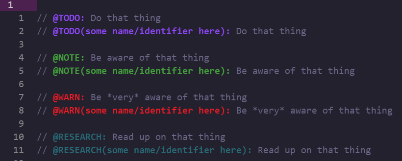

# at-notes

At-notes are notes in comments with different tags attached to them. I've made
this extension specifically for the ones I'm interested in and I'm not likely to
make it all that configurable for quite some time.

## Supported tags

Currently the following tags are supported:

```typescript
// @TODO: Do that thing
// @TODO(some name/identifier here): Do that thing

// @NOTE: Be aware of that thing
// @NOTE(some name/identifier here): Be aware of that thing

// @WARN: Be *very* aware of that thing
// @WARN(some name/identifier here): Be *very* aware of that thing

// @RESEARCH: Read up on that thing
// @RESEARCH(some name/identifier here): Read up on that thing
```

The example above is rendered as follows given the example token settings below:



```json
{
  "editor.tokenColorCustomizations": {
    "textMateRules": [
      {
        "scope": "meta.embedded.at-note.todo",
        "settings": {
          "foreground": "#923ffd",
          "fontStyle": "bold"
        }
      },
      {
        "scope": "meta.embedded.at-note.note",
        "settings": {
          "foreground": "#26a137",
          "fontStyle": "bold"
        }
      },
      {
        "scope": "meta.embedded.at-note.warn",
        "settings": {
          "foreground": "#FF0000",
          "fontStyle": "bold"
        }
      },
      {
        "scope": "meta.embedded.at-note.research",
        "settings": {
          "foreground": "#036a77",
          "fontStyle": "bold"
        }
      }
    ]
  }
}
```

## TODO search for your project

I've created a problem matcher for `@TODO` tags in the project. It can be used
with a custom tags specifying the following in `tasks.json`, in this example
using `rg` (`ripgrep`):

```json
{
  "type": "shell",
  "command": "rg",
  "args": ["--vimgrep", "\"@TODO`(`(.+`)`)?:\"", "."],
  "problemMatcher": "$at-note-todo",
  "label": "todo search"
}
```

The problem matcher name is `$at-note-todo` and it matches lines that look like
`relativefilename:line:column:// @TODO:` or
`relativefilename:line:column:// @TODO(<something here>):`

When the task is done the problem matcher will show your TODO positions in the
"Problems" tab.